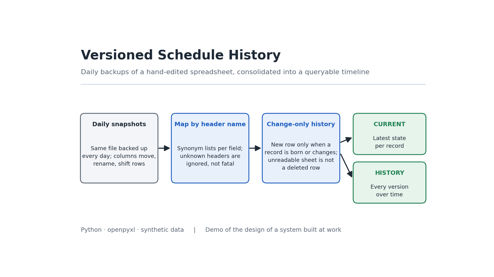

# Versioned Production Schedule History



Daily backup of a hand-edited scheduling file, and consolidation of those backups into a single database with a queryable timeline.

This repository is a **demo reimplementation** of a system I put into production over the schedule of 22 work centers. The code published here is original, works with synthetic data, and contains no company information.

---

## The problem

The production schedule lived in a single Excel file, edited daily by several people. That file had two uncomfortable characteristics:

**There was no history.** Only today's state existed. Questions such as "what had we scheduled for this order last week?" or "how many times has this machine been rescheduled?" had no answer, because the previous data was overwritten.

**There was no safety net.** A shared file edited by many people ends up breaking.

That second point stopped being hypothetical. On August 31 someone deleted a column and left 1,850 cells with broken references, destroying the scheduling sequence of the two main machines. It could be rebuilt because the backup from two days earlier existed.

## The approach

Two pieces that complement each other.

### 1. Daily backup

A scheduled task copies the file every morning to a history folder, automatically organized by month and year. It retries if the file is open at that moment, and writes the full execution context to the log.

That detail about context is not decorative: when a scheduled task fails on a server, knowing which user and interpreter it ran under is usually the difference between solving it in minutes or spending the afternoon guessing.

### 2. Consolidation with versioning

The backups on their own are a folder with hundreds of files. The second piece turns them into a queryable database with two layers:

| Sheet | Contents |
|---|---|
| `VIGENTE` | The current state of each record. The table to query and join. |
| `HISTORICO` | One row each time a record is born or changes. |
| `AVISOS` | Sheets that could not be read. The one to review. |

---

## The three decisions that hold the system up

### Mapping by header name, not by position

The source file is edited by hand by the production area. Columns move, get renamed, and new ones appear. The same field shows up as `TIROS`, `CANTIDAD` or `CANTIDAD PEDIDA` depending on who edited the sheet, and the header is not always in row 1.

Reading by position works until the first day someone inserts a column. From then on it loads data into the wrong field **without raising any error**, which is the worst way to fail: nobody finds out until someone notices the figures do not add up, weeks later.

The consolidator keeps a synonym list per field, looks for the header row in the first twelve, and ignores headers it does not recognize instead of breaking the load.

### History by changes, not by full snapshots

Storing the entire snapshot of each day is simple to read and hits Excel's row limit in about a year. Storing only when something is born or changes preserves exactly the same information: to know how a record stood on any date, take its latest version with a snapshot less than or equal to that date.

What decides what counts as a "change" are the business fields. The traceability ones — snapshot date, source file — are left out on purpose. If they were included, every day would generate a new version of absolutely everything and the approach would stop being useful.

In this repository, with twenty simulated days, the reduction is around **34%**. On the real schedule, which changes far less between days, it was **82%** while keeping the same history.

### An unreadable sheet is not a deleted row

This is the subtle part.

When rebuilding the current state, the consolidator advances day by day. If a row stops appearing, the normal conclusion is that it was deleted and it should be removed from the current state. But there is another explanation: that sheet could not be read that day.

Confusing the two has a serious consequence. A file with a corrupt sheet on a Tuesday would erase that machine's entire schedule from the current state, and the system would give no sign that anything happened.

That is why the consolidator records which sheets it actually read each day, and **only purges keys within the sheets it was able to read**. The ones that were missing are left intact and reported in `AVISOS`.

---

## Running it

Requires Python 3.10 or higher.

```bash
pip install -r requirements.txt

python generar_snapshots.py   # creates 20 days of backups with variable layout
python consolidador.py        # produces BD_PROGRAMACION.xlsx
```

The generator deliberately reproduces the real problem: each file has the columns in a different order, with different names, headers on different rows, and an occasionally unreadable sheet. Open a couple of files from `snapshots/` and compare them to see it.

Typical output:

```
Procesando 14 respaldos...

Filas leidas                  323
Historico (CAMBIOS)           212  (34% menos)
Registros vigentes             24  (3 son eventos, no produccion)
Avisos de lectura               3

Hojas que no se pudieron leer:
  PROGRAMACION 07092026.xlsx / CONV.: Sin encabezados reconocibles
```

The program's console output is in Spanish, as in the original system. Unreadable sheets are reported and their records are **not** treated as deleted.

---

## Structure

| File | Contents |
|---|---|
| `generar_snapshots.py` | Creates the example backups with variable layout |
| `consolidador.py` | Header mapping, versioning and rebuilding of the current state |

---

## Differences from the production version

| | Here | Production |
|---|---|---|
| Source | generated files | `.xlsm` on a network folder |
| Work centers | 5 | 22 |
| Backup | out of scope | daily scheduled task with retries |
| Synonyms per field | 10 fields | 26 fields |
| Special cases | none | forced mapping for sheets with shifted headers |

On that last point: in the real file there are sheets where the titles are shifted one column relative to the data, and others where the shift headers live in a different row than the rest. Those cases are not solved with synonyms and carry an explicit per-sheet mapping.

---

## A note on how it was built

The consolidator was developed with AI assistance. The system's design — keeping daily backups before you need them, mapping by header instead of by position, and not confusing an unreadable sheet with a deleted row — responds to concrete problems observed in the operation, and the reported figures were verified against the real files.

---

## Possible extensions

- Detection of time overlaps between segments of the same machine
- Alert when a record changes more than N times in a week, as a signal of excessive rescheduling
- Output to a database instead of Excel, to remove the row limit

---

## License

MIT
